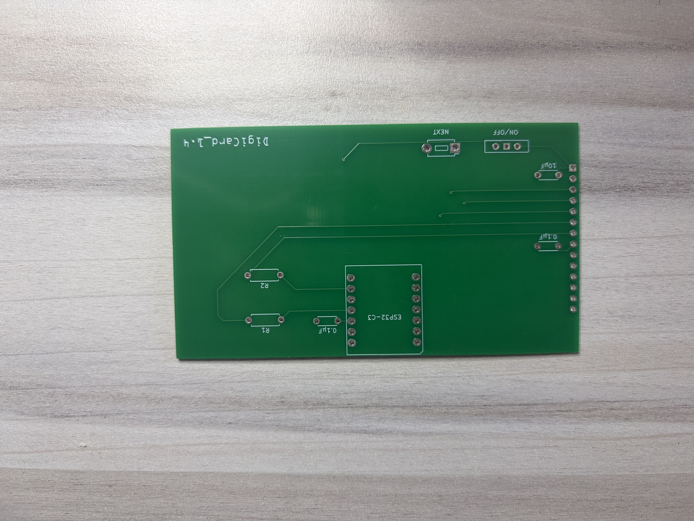
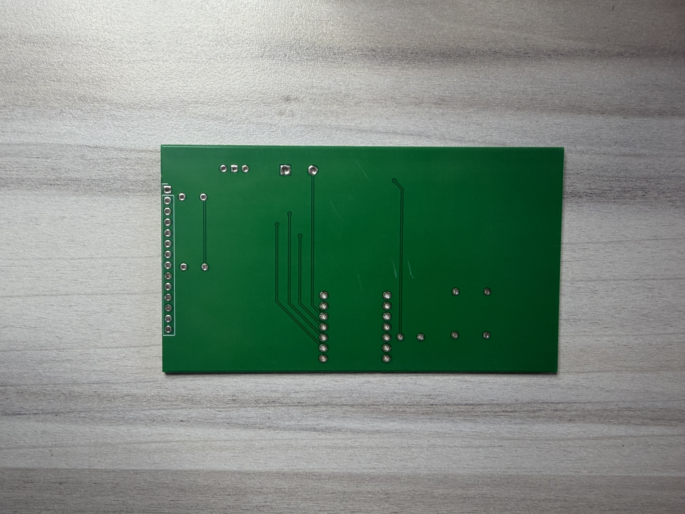

# Hardware

The digital business card uses a custom PCB and a three-part printed enclosure. PCB assembly, wiring, and the physical prototype are complete.

## Directory Layout

```text
schematic/
    Project_Buisiness_Card.kicad_pro  KiCad project
    Project_Buisiness_Card.kicad_sch  Circuit schematic
    Project_Buisiness_Card.kicad_pcb  PCB layout
    fp-lib-table                    Footprint libraries
    sym-lib-table                   Symbol libraries
    Library.pretty/                 Custom footprint library
    libraries/                      XIAO symbols and footprints
manufacturing/
    Buisiness_Card_Gerbers_1.2.zip
    Buisiness_Card_Gerbers_1.3.zip
    Project_Buisiness_Gerbers_1.4.zip
enclosure/
    Top_Case.stl
    Bottom_Case.stl
    Button (1).stl
```

The schematic, PCB, and project settings share a directory and base name so KiCad can associate them as one project.

## KiCad Project

Open [Project_Buisiness_Card.kicad_pro](schematic/Project_Buisiness_Card.kicad_pro) in KiCad 9.0. The XIAO libraries are stored locally and use project-relative paths.

The PCB uses a custom through-hole XIAO footprint. The original surface-mount footprint is available under a separate library name. The active assignment uses the through-hole version.

[Library documentation](schematic/libraries/README.md) describes the footprint variants, project assignments, and upstream sources.

## Fabricated PCB

Bare revision 1.4 PCB before component installation. The component side shows the XIAO footprint, display header, passive-component positions, and button and power-switch connections.

| Component side | Reverse side |
|---|---|
|  |  |

## Manufacturing Files

Version **1.4** is the current hardware revision. Versions 1.2 and 1.3 are retained as earlier exports. Each archive contains Gerber layers and plated/non-plated drill files.

## Enclosure

The enclosure consists of a [top case](enclosure/Top_Case.stl), [bottom case](enclosure/Bottom_Case.stl), and [button](<enclosure/Button (1).stl>).

See the [enclosure documentation](enclosure/README.md) for the printable models.

## Components

| Component | Quantity | Function |
|---|---:|---|
| Seeed Studio XIAO ESP32-C3 | 1 | Display control and button processing |
| 3.5-inch ILI9488 SPI TFT | 1 | Contact-information and QR-code display |
| SPST slide switch | 1 | LCD power control |
| Momentary pushbutton | 1 | Slide navigation and display recovery |
| 1 × 14 header, 2.54 mm pitch | 1 | LCD connection |

## Schematic Values and Footprint Assignments

These entries describe the KiCad design. Switch model names identify the assigned footprints.

| Reference | Schematic value | Footprint |
|---|---|---|
| U1 | XIAO ESP32C3 | Project-specific through-hole XIAO footprint |
| SW1 | SW_SPST | Wuerth WS-SLTV slide-switch footprint |
| SW2 | SW_Push | APEM MJTP1243 pushbutton footprint |
| J_LCD1 | Conn_01x14 | 1 × 14 pin header, 2.54 mm pitch |
| J_BAT1 | Two-pin connector | — |
| C1, C3 | 0.1 µF | Radial capacitor, 5 mm lead spacing |
| C2, C4 | 10 µF | Radial capacitor, 5 mm lead spacing |
| R4, R6 | `46` | Axial resistor, 7.62 mm lead spacing |

The [design specification](../docs/design.md#existing-prototype-wiring) contains the GPIO mapping and LCD power behavior.
